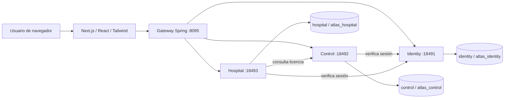

# Arquitectura de Atlas Link

## Separación

Un artefacto JAR por servicio y un proceso por artefacto. `common` comparte utilidades de contrato, identidad y errores, no un servicio ni acceso global a datos. Los esquemas PostgreSQL tienen propietarios de migración y usuarios runtime distintos. No existen joins ni claves foráneas entre servicios. Una instalación puede separar físicamente las bases manteniendo estos contratos.

El gateway conserva el contrato `/api` de la interfaz. Los endpoints `/internal` no se enrutan al navegador. Autorización y tenant se comprueban en el servicio final, no solamente en el gateway. Las comunicaciones internas de operaciones comerciales exigen identidad y una clave de servicio externa al repositorio; despliegue real debe añadir red privada y TLS/identidad de workload según infraestructura elegida.

## Consistencia

Hospital mantiene en una misma transacción cuenta, líneas, evaluación y eventos asociados. Se usan importes decimales, versión de convenio fija, claves de idempotencia y bloqueo optimista. La cuota de licencia se consulta a Control; Hospital protege el consumo concurrente al crear cuentas.

Alta de hospital y creación de administrador cruzan dos servicios. Se registra primero el cliente/licencia; si falla el paso de identidad se devuelve un estado recuperable. El endpoint de provisión debe poder reintentarse sin recrear usuarios o cambiar sus contraseñas. No se declara atomicidad distribuida inexistente.

## Disponibilidad y desempeño

Verificar una sesión consulta Identity; falla cerrada si no puede validarla. Una caída de Identity afecta nuevas peticiones autenticadas. Esto favorece revocación inmediata en esta versión; una evolución con JWT/OIDC requiere elegir expiración, caché de claves y política de revocación. No introducir cachés de permisos indefinidas.

Las pantallas operativas priorizan tablas, formularios y tiempos de respuesta; los efectos visuales se concentran en la presentación y acceso, respetando movimiento reducido y dispositivos pequeños. Las fotografías son locales y optimizadas; los recursos dinámicos se cargan cuando corresponden.

## Límites reales

La instalación local no acredita alta disponibilidad, rendimiento de producción ni seguridad externa. Antes del piloto se debe ejecutar carga con volúmenes representativos, recuperación de respaldo, revisión de accesos y dispositivos reales. El soporte de navegador adaptable no equivale a una app nativa o modo sin conexión.
