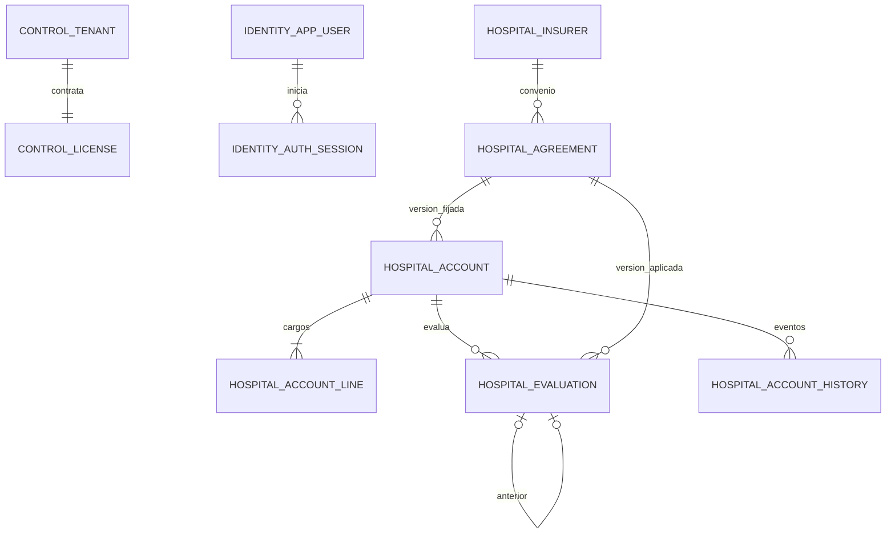

# Datos de Atlas Link

PostgreSQL 15 es la base elegida. Las cuentas, convenios, licencias e identidad necesitan transacciones, importes decimales, integridad y consultas relacionales. No existe evidencia que justifique sustituirlo por Oracle, MongoDB o un grafo. Los parámetros variables del tabulador se guardan como un documento JSONB dentro de una versión de convenio; no requieren otro motor. La adopción de otro almacén exigiría una consulta o carga medida que PostgreSQL no resuelva adecuadamente.

## Propiedad por microservicio

Un clúster local aislado escucha en `127.0.0.1:5440`, base `atlas_link`. Compartir infraestructura no concede acceso entre servicios. Cada proceso aplica sus propias migraciones Flyway y usa su propia tabla de historial dentro de su esquema.

| Servicio | Esquema | Rol de aplicación | Dueño/migrador | Tablas propias |
| --- | --- | --- | --- | --- |
| Identidad | `identity` | `atlas_identity` | `atlas_identity_owner` | `app_user`, `auth_session` |
| Control comercial | `control` | `atlas_control` | `atlas_control_owner` | `tenant`, `license`, `lead` |
| Hospital | `hospital` | `atlas_hospital` | `atlas_hospital_owner` | `insurer`, `agreement`, `hospital_account`, `account_line`, `evaluation`, `account_history`, `audit_event` |

Los roles de aplicación no son propietarios, superusuarios ni `BYPASSRLS`; no reciben permisos sobre otros esquemas. Las contraseñas se provisionan fuera de las migraciones. Los UUID de hospital y actor son referencias entre servicios: su existencia y autorización se verifican mediante los contratos HTTP, sin consultas ni claves foráneas a las tablas de otro servicio. Las claves foráneas internas sí incluyen el hospital, evitando enlazar una línea o evaluación a una cuenta de otro cliente.

`tenant_id` y `actor_id` también aparecen como referencias lógicas en los otros servicios. `audit_event` permite referencias a distintos tipos de entidad; `lead` recoge solicitudes comerciales consentidas. No se guardan nombres ni documentos reales de pacientes: `patient_reference` es una referencia seudonimizada.

## Aislamiento y autenticación

Cada transacción autenticada ejecuta `set_config('app.tenant_id', :tenant, true)`, `set_config('app.user_id', :actor, true)` y `set_config('app.platform_admin', :platform, true)`. El valor `true` restringe la configuración a esa transacción; no se hereda al siguiente uso de una conexión del pool. Los valores provienen de la identidad verificada, nunca de un encabezado libre del cliente. Sin contexto no se leen filas hospitalarias. El administrador de plataforma accede a metadatos comerciales; su indicador no elimina el filtro de hospital sobre cuentas.

RLS complementa la autorización de la API; quien obtiene credenciales SQL de un servicio puede establecer esas variables y no debe considerarse un usuario final autorizado. Las credenciales no salen del servidor. Los dueños y superusuarios pueden eludir RLS: se reservan para migración y operación; la aplicación siempre usa los roles limitados. Estas propiedades están documentadas en [Row Security Policies de PostgreSQL 15](https://www.postgresql.org/docs/15/ddl-rowsecurity.html).

`identity.find_login_user(email)` y `identity.find_session_user(token_hash)` son las únicas búsquedas de identidad globales. Se ejecutan con privilegios del dueño, `search_path` fijo y ejecución revocada a `PUBLIC`. Se limitan a un correo normalizado o un hash exacto de token vigente. El backend verifica BCrypt y genera tokens aleatorios; la base conserva únicamente el hash SHA-256 del token. Creación y revocación de sesión quedan limitadas al actor autenticado. El uso seguro de funciones con privilegios del dueño requiere estas restricciones, según [CREATE FUNCTION](https://www.postgresql.org/docs/15/sql-createfunction.html).

El formulario público puede insertar un lead con consentimiento, pero no consultar leads. El backend debe asignar el UUID antes del INSERT y evitar `RETURNING` público, porque devolver la fila exigiría permiso de lectura. Solo plataforma puede listarlos.

## Invariantes y dinero

- UUID por entidad; unicidad de folio e idempotencia dentro del hospital. Hash de contenido único cuando existe, sin deduplicación entre hospitales.
- Importes `numeric(14,2)`, cantidades `numeric(12,3)` y coaseguro entre 0 y 1. La línea calcula `round(quantity * unit_price, 2)` en una columna generada. Fechas de estancia como `date`; eventos como `timestamptz`.
- La evaluación reconcilia exactamente: `billed_total = tariff_adjustment + insurer_estimate + patient_estimate + unresolved_amount`. `patient_estimate = deductible + coinsurance`; los excluidos son parte de lo no resuelto, no una segunda suma ni deuda automática del paciente.
- Un convenio publicado es inmutable; una nueva versión tiene un ID nuevo. La evaluación conserva convenio, versión, versión de motor, importes, hallazgos y evaluación anterior de la misma cuenta. La FK comprueba que ID y número de versión coincidan.
- Evaluaciones, historial y auditoría solo aceptan INSERT por la aplicación. Triggers también rechazan UPDATE/DELETE. Esto protege el uso normal; no equivale a un registro criptográfico invulnerable frente al administrador de infraestructura.
- La aplicación usa `version` para actualizaciones optimistas, incluyendo licencias y cuentas; el UPDATE debe filtrar por la versión recibida y avanzar el contador en la misma transacción. Los permisos por rol y las transiciones de estado pertenecen al servicio, además de los estados permitidos en SQL.

[PostgreSQL documenta `numeric` como tipo exacto y sus reglas de redondeo](https://www.postgresql.org/docs/15/datatype-numeric.html). Backend y SQL usan la misma escala; no se emplea punto flotante para calcular importes.

## Migraciones y demostración

Ubicaciones: `backend/src/main/resources/db/migration/identity`, `control` y `hospital`. Cada una contiene `V1__schema.sql` y `V2__demo_data.sql`. Los procesos empaquetan exclusivamente su ubicación. V2 requiere el placeholder Flyway `demoEnabled`; con `false` no inserta datos. Activarlo posteriormente no vuelve a ejecutar V2: un entorno de demostración debe provisionarse expresamente desde el comienzo.

Los datos incluyen dos hospitales ficticios, seis perfiles principales, un perfil del segundo hospital y una cuenta desactivada; tres aseguradoras ficticias; cuatro versiones de convenio; veinte cuentas, sesenta y tres líneas y veinte evaluaciones. Hay ejemplos de exceso de tabulador, exclusión, póliza incompleta, código sin homologar, cobertura agotada y falta de convenio. Todos los precios y parámetros son demostrativos, sin prescripción ni afirmaciones clínicas. La contraseña compartida `AtlasDemo2026!` usa BCrypt coste 12 y existe solo para la demostración.

Una instalación no demo debe dejar `demoEnabled=false`, no publicar perfiles demo y provisionar su identidad real. Ocultar las tarjetas en frontend no desactiva credenciales ya sembradas; se debe usar una base sin semillas o desactivar explícitamente esos usuarios y sesiones mediante un procedimiento controlado.

## Consultas, crecimiento y operación

Índices principales: bandeja `(tenant_id,status,lane,created_at,id)`, cuentas recientes por hospital, líneas por cuenta, última evaluación por cuenta, resolución de convenio por aseguradora y vigencia, auditoría por hospital/fecha y expiración de sesiones. No se añaden particiones, réplicas ni otra base sin medir la carga. Con datos representativos se deben comprobar planes, distribución por hospital, coste de búsquedas textuales y tiempos de importación; veinte cuentas no acreditan capacidad de millones de filas.

El respaldo debe incluir los tres esquemas, los roles necesarios y los historiales Flyway; restaurarlos en otra base y verificar conciliación/aislamiento es parte de la recuperación. Ni el plazo tolerable de pérdida de datos (RPO) ni el tiempo de recuperación objetivo (RTO) están acordados; deben fijarse antes de contratar un servicio real. El puerto local y los datos sintéticos no constituyen un despliegue productivo.

## Retención: conflicto pendiente de definición

El alcance original pide borrar detalle a los 30 días y conservar auditoría. Las justificaciones, snapshots de correcciones y hallazgos también pueden incluir información sensible. Borrar solo `account_line` no implementaría esa intención, mientras que modificar evidencia rompería la promesa de inmutabilidad.

Por ello no se activa un borrado automático sin una política aprobada. Antes del piloto se deben decidir los campos retenidos, plazos, fundamento, tratamiento de backups y referencias seudónimas; después implementar un proceso privilegiado específico que conserve solo metadatos permitidos y registre el borrado. La aplicación ordinaria no recibe DELETE sobre evidencia. No se afirma cumplimiento legal por tener RLS o cifrado del proveedor.

## Validación reproducible

Las migraciones deben ejecutarse como cada dueño con `ON_ERROR_STOP` o Flyway; la cuenta runtime nunca migra. Comprobaciones sobre la instalación demo:

1. Tres historiales Flyway independientes; dueños correspondientes, sin grants cruzados; roles runtime sin SUPERUSER/BYPASSRLS.
2. Contexto vacío: cero cuentas. Tenant principal: dieciocho; tenant secundario: dos. Cambiar solamente `app.platform_admin` no concede acceso a cuentas del otro hospital.
3. INSERT de línea con un `tenant_id` distinto al de su cuenta: rechazo RLS o FK. Actualizar convenio publicado, evaluación o auditoría: rechazo.
4. Suma de líneas activas igual al total de cada cuenta; igualdad financiera en todas las evaluaciones; versión aplicada consistente.
5. Inicio de sesión BCrypt, expiración/revocación, perfil desactivado y denegación de tablas de otros servicios mediante la API y usuarios SQL reales.

Estado de evidencia se actualizará tras la ejecución contra el clúster local; las instrucciones anteriores no implican por sí solas que estas comprobaciones se hayan ejecutado.
